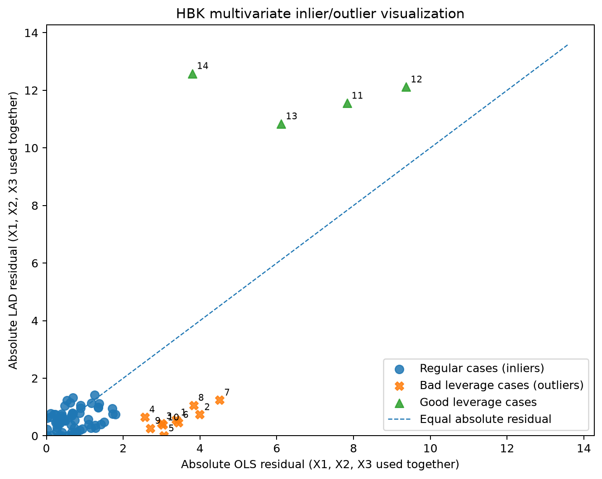
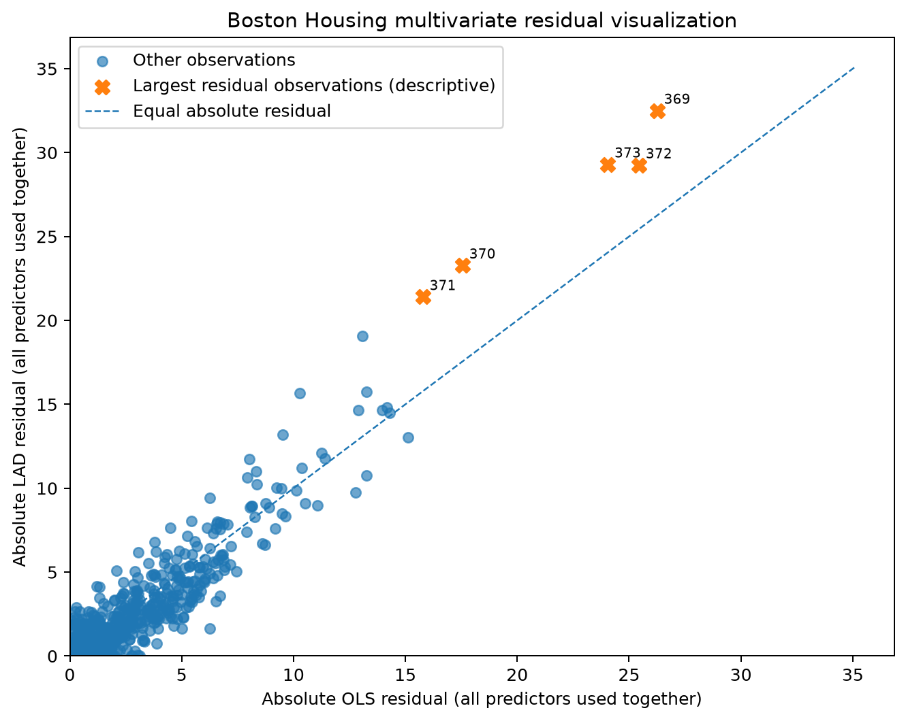
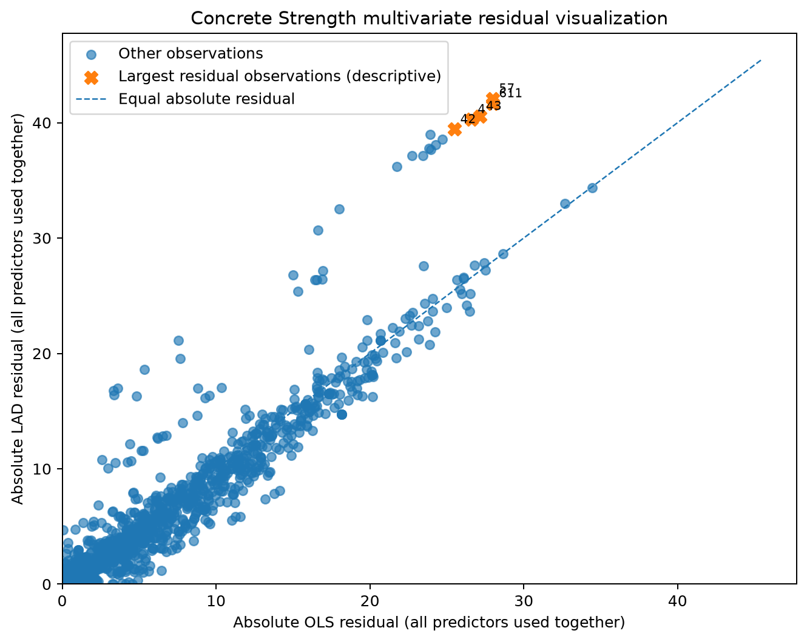

# Regression by Minimizing Absolute Deviation

This project compares Ordinary Least Squares (OLS) and Least Absolute Deviations (LAD) regression using three empirical datasets: Boston Housing, Concrete Compressive Strength, and Hawkins-Bradu-Kass (HBK). The methodology is restricted to six core LAD papers by Wagner (1959), Barrodale & Roberts (1973), Bassett & Koenker (1978), Bloomfield & Steiger (1980), Narula & Wellington (1982), and Pollard (1991).

The complete executed workflow is available in [`notebooks/absolute_deviation_full_workflow.ipynb`](notebooks/absolute_deviation_full_workflow.ipynb).

## Objective

> How does regression obtained by minimizing absolute deviations differ from regression obtained by minimizing squared deviations, particularly when observations contain large or extreme errors?

For residuals

$$
r_i = y_i - x_i^T\beta,
$$

OLS minimizes

$$
\min_{\beta}\sum_{i=1}^{n} r_i^2,
$$

while LAD minimizes

$$
\min_{\beta}\sum_{i=1}^{n} |r_i|.
$$

For the linear-programming formulation of LAD,

$$
r_i = e_i^+ - e_i^-, \qquad e_i^+ \ge 0, \quad e_i^- \ge 0,
$$

with objective

$$
\min \sum_{i=1}^{n}\left(e_i^+ + e_i^-\right).
$$

## Empirical visualizations

### Hawkins-Bradu-Kass (HBK)

HBK contains existing case-group labels, so regular, good-leverage, and bad-leverage observations can be shown directly using residuals from the full multivariate OLS and LAD fits.



### Boston Housing

Boston Housing has no supplied outlier labels, so the figure is a descriptive residual-space visualization using all active predictors.



### Concrete Compressive Strength

Concrete Strength is visualized in the same multivariate residual space without introducing an external outlier-detection method.



## Run

```powershell
python -m pip install -r requirements-dev.txt
python scripts/generate_all_results.py
python -m pytest
```

Generated results are stored in `outputs/results/` and figures in `outputs/figures/`. Method details are available in `docs/`.
