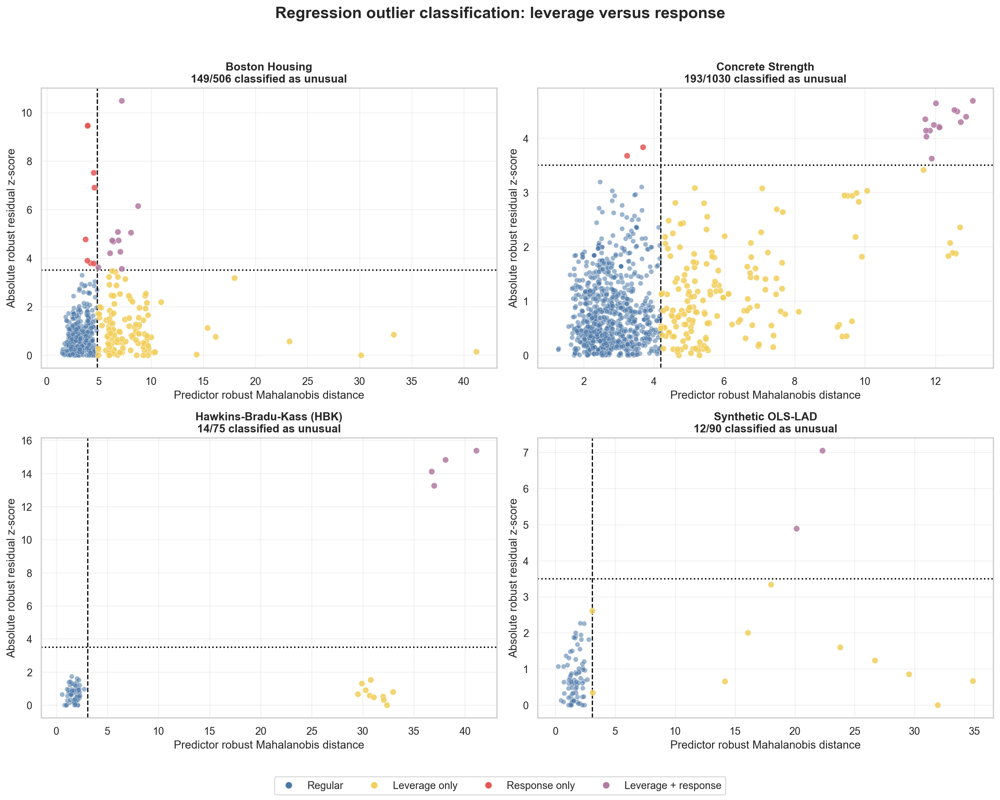
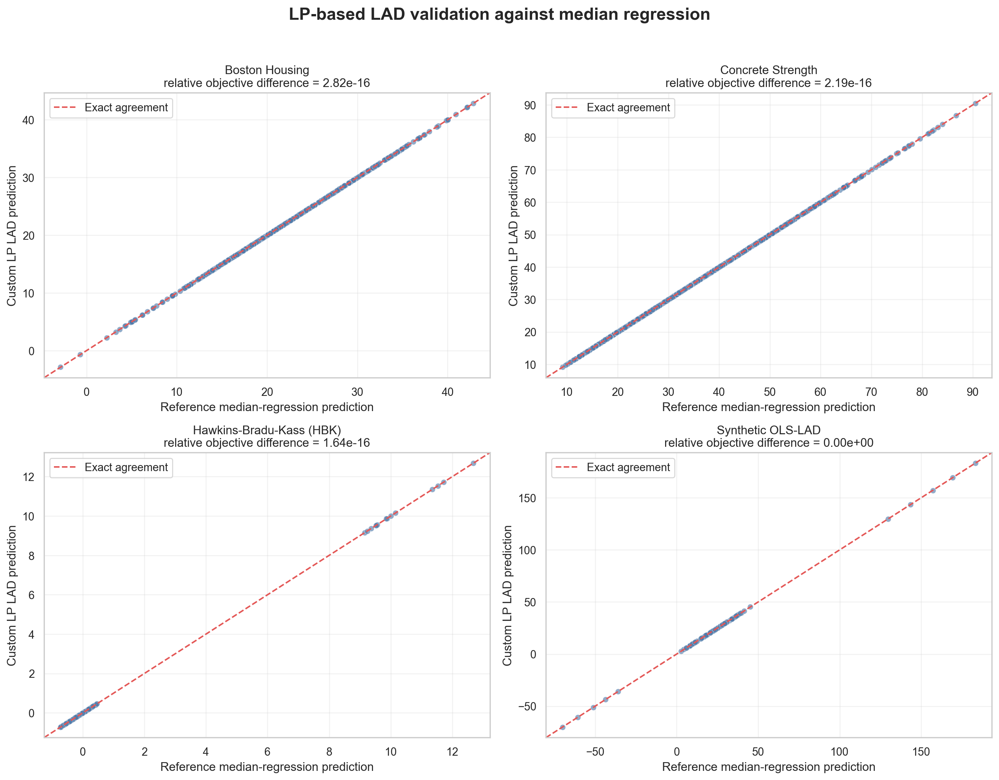
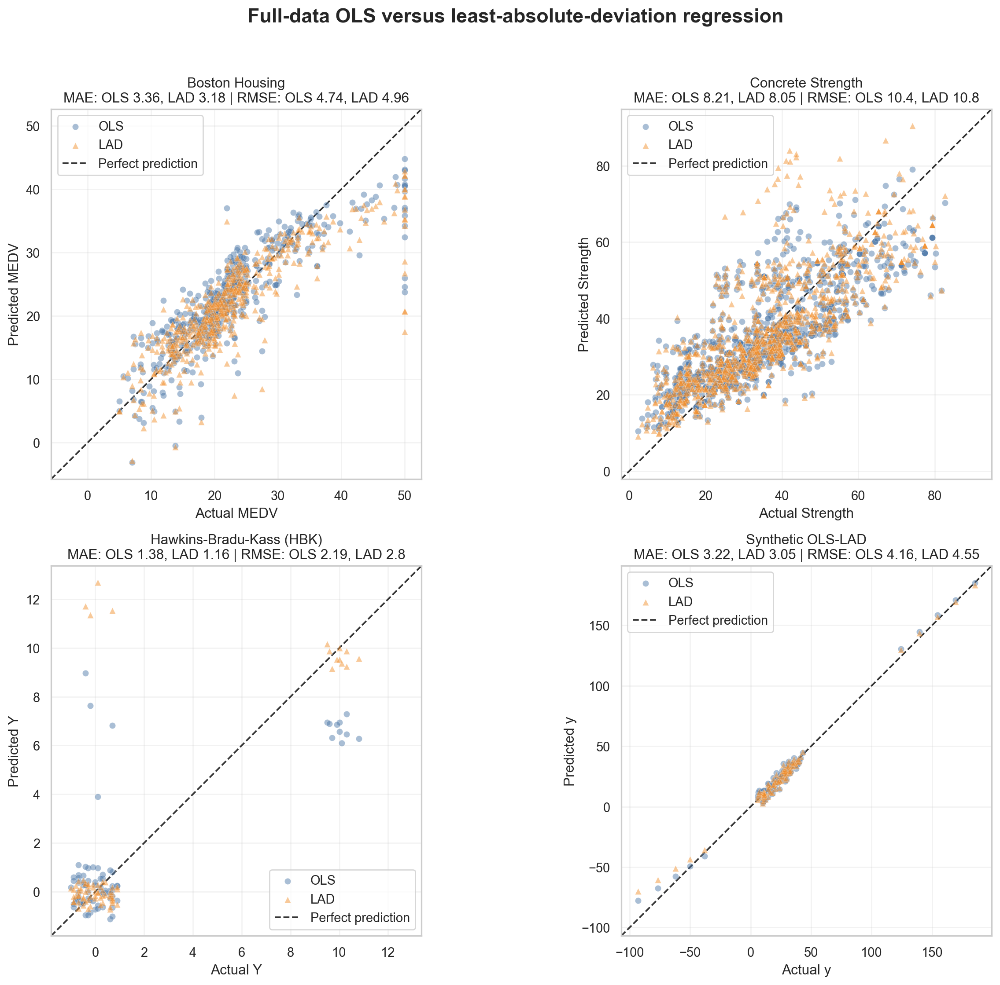

# Regression by Minimizing Absolute Deviation

Reproducible research code and datasets for studying robust regression and
multivariate outliers in Boston Housing, Concrete Strength, Hawkins-Bradu-Kass
(HBK), and a synthetic OLS/LAD dataset.

The current workflow robust-scales each dataset, estimates its multivariate
center and covariance with Minimum Covariance Determinant (MCD), and flags rows
whose robust Mahalanobis distance exceeds the 97.5% chi-square cutoff. PCA is
used only to visualize the distributions.

## Joint data-distribution outliers


*Figure 1. Robust-scaled PCA distributions for the four datasets. Blue points
are inliers; red points are observations flagged as multivariate outliers.*

## Regression outlier classification



*Figure 2. Predictor-space leverage versus conditional response deviation.
Blue = regular, yellow = leverage only, red = response only, and purple = both.*

## LP-based LAD solver



*Figure 3. Custom sparse linear-programming LAD predictions versus unpenalized
median-regression reference predictions. All four objectives agree within
floating-point error.*

## Full-data OLS and LAD baselines



*Figure 4. Actual responses versus full-data OLS and LAD predictions. OLS
minimizes squared error; LAD minimizes absolute error. These in-sample fits are
descriptive baselines, not estimates of performance on unseen data.*

## Repository layout

```text
.
|-- .github/workflows/       # Automated tests
|-- data/
|   |-- raw/                 # Original downloaded files
|   `-- processed/           # Analysis-ready CSV files
|-- docs/                    # Method documentation
|-- outputs/
|   |-- figures/             # Individual and merged diagrams
|   `-- results/             # Row-level flags and summary CSV
|-- scripts/                 # User-facing command-line scripts
|-- src/outlier_analysis/    # Reusable Python package
|-- tests/                   # Automated regression tests
|-- pyproject.toml           # Package and test configuration
`-- requirements*.txt        # Runtime and development setup
```

## Quick start

Python 3.10 or newer is required.

```powershell
python -m venv .venv
.\.venv\Scripts\Activate.ps1
python -m pip install -r requirements.txt
python scripts/analyze_outliers.py
python scripts/validate_lad.py
python scripts/fit_baseline_models.py
```

After installation, this equivalent command is also available:

```powershell
analyze-outliers
validate-lad
fit-baseline-models
```

## Test

```powershell
python -m pip install -r requirements-dev.txt
python -m pytest
```

## Outputs

- `outputs/figures/`: one diagram per dataset and one merged diagram;
- `outputs/results/`: joint outlier results plus regression-specific leverage and
  response classifications, LAD validation results, and full-data OLS/LAD
  metrics, coefficients, and predictions.

Blue points are inliers. Red points are robust-distance outliers. A flag means
that a row is unusual relative to the central multivariate pattern; it does not
automatically mean the observation is erroneous.

See [outlier method notes](docs/outlier_method.md) and
[LAD solver notes](docs/lad_solver.md) for calculation details. The
[baseline model notes](docs/baseline_models.md) describe the full-data OLS/LAD
comparison and its limits.
