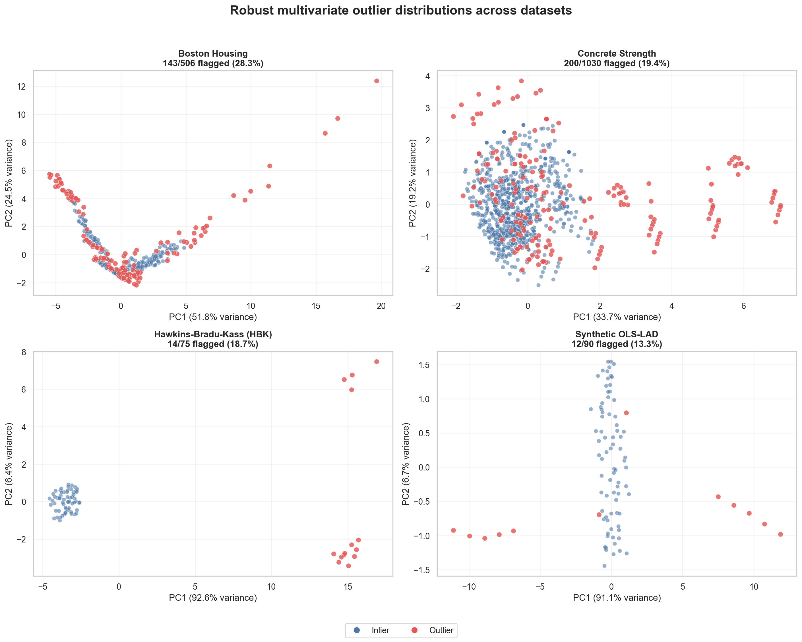

# Regression by Minimizing Absolute Deviation

Reproducible research code and datasets for studying robust regression and
multivariate outliers in Boston Housing, Concrete Strength, Hawkins-Bradu-Kass
(HBK), and a synthetic OLS/LAD dataset.

The current workflow robust-scales each dataset, estimates its multivariate
center and covariance with Minimum Covariance Determinant (MCD), and flags rows
whose robust Mahalanobis distance exceeds the 97.5% chi-square cutoff. PCA is
used only to visualize the distributions.

## Outlier distributions



*Figure 1. Robust-scaled PCA distributions for the four datasets. Blue points
are inliers; red points are observations flagged as multivariate outliers.*

## Repository layout

```text
.
|-- .github/workflows/       # Automated tests
|-- data/
|   |-- raw/                 # Original downloaded files
|   `-- processed/           # Analysis-ready CSV files
|-- docs/                    # Method documentation
|-- outputs/
|   |-- figures/             # Individual and merged diagrams
|   `-- results/             # Row-level flags and summary CSV
|-- scripts/                 # User-facing command-line scripts
|-- src/outlier_analysis/    # Reusable Python package
|-- tests/                   # Automated regression tests
|-- pyproject.toml           # Package and test configuration
`-- requirements*.txt        # Runtime and development setup
```

## Quick start

Python 3.10 or newer is required.

```powershell
python -m venv .venv
.\.venv\Scripts\Activate.ps1
python -m pip install -r requirements.txt
python scripts/analyze_outliers.py
```

After installation, this equivalent command is also available:

```powershell
analyze-outliers
```

## Test

```powershell
python -m pip install -r requirements-dev.txt
python -m pytest
```

## Outputs

- `outputs/figures/`: one diagram per dataset and one merged diagram;
- `outputs/results/`: row-level distances/flags and `outlier_summary.csv`.

Blue points are inliers. Red points are robust-distance outliers. A flag means
that a row is unusual relative to the central multivariate pattern; it does not
automatically mean the observation is erroneous.

See [the method notes](docs/outlier_method.md) for calculation details and
dataset-specific caveats.
